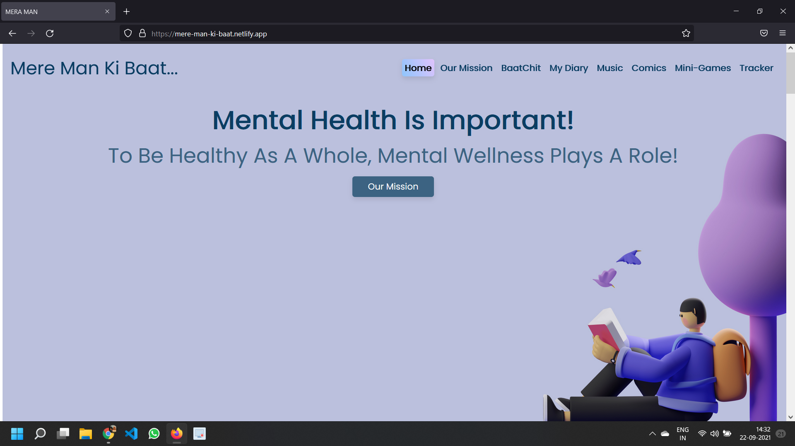
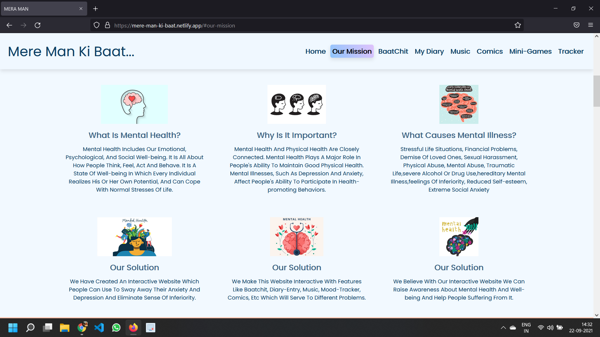

# Mere-Man-Ki-Baat

 ## Project with Sawo-Auth  https://mere-mann-ki-baat-sawo-auth.netlify.app/
 ## Project-Netlify https://mere-man-ki-baat.netlify.app/
 
 ## INTRODUCTION:
 
 WE HAVE BUILT AN INTERACTIVE WEBSITE THAT WILL HELP PEOPLE WITH DEPRESSION AND ANXIETY
 AND RAISE AWARENESS ABOUT THE IMPORTANCE OF GOOD MENTAL HEALTH.
 
 
 ## ABOUT THE PROJECT:
 
 WE HAVE BUILD AND DEVELOPED A INTERACTIVE WEBSITE THAT WILL HELP A PERSON DEAL WITH DEPRESSION, ANXIETY, OR A SENSE OF LONELINESS.

OUR WEBSITE FEATURES:-
A BAATCHIT AAP MADE USING REACT
A DIARY ENTRY MADE USING REACT
A MUSIC APP MADE USING REACT
A COMIC SECTION MADE USING HTML, CSS, JS.
A MOOD TRACKER MADE USING HTML, CSS, JS.
A WORK TODO APP MADE USING NODEJS AND MONGODB.
MINI-GAMES MADE USING HTML, CSS, JS.

BAATCHIT IS A INTERACTIVE GROUP CHAT APP WHERE A USER CAN LOG IN AND CHAT WITH OTHER USERS AND EXPRESS AND EXCHANGE THEIR FEELING AND EMOTIONS.

A DIARY-ENTRY APP IS A TECH-SAVVY VERSION OF A PERSONAL DIARY AND HERE USERS CAN WRITE DOWN NOTES ABOUT THEIR DAY AND EXPERIENCES.

WE CREATED THIS MUSIC APP WHICH HAS A VARIETY OF SOOTHING AND PEACEFUL MUSICAL TUNES TO HELP USERS RELAX, MEDITATE AND FEEL BETTER. MUSIC IS BELIEVED TO HAVE HEALING POWERS.
 
BOOKS ARE HUMAN’S BEST FRIENDS.

WE DESIGNED THE COMIC SECTION SO THE USER CAN REFRESH THEMSELVES AND INCREASE THEIR FOCUS POWER.

MOOD TRACKER IS AN APP THROUGH WHICH A USER CAN KEEP A TRACK OF THEIR MOOD OVER A PERIOD OF TIME AND THIS WILL HELP THEM MAKE BETTER LIFE DECISIONS AND PLAN THINGS ACCORDING.

WORK TODO IS AN APP THROUGH WHICH THE USER CAN BE ORGANISED AND THIS WILL HELP THEM FREE THEIR ANXIETY AND OCD.

NOT ORDINARY GAMES, MINI-GAMES HAVE SOME INTERESTING PLAYABLE WHICH WILL HELP IN INCREASING CONCENTRATION AND FOCUS.

GOOD CONCENTRATION AND FOCUS POWER MAKES THE MIND HEALTHY AND HELPS COME OUT OF ANXIETY AND DEPRESSION.

THE ABOVE FEATURES WERE ADDED KEEPING IN MIND THE VARIOUS NEEDS OF PEOPLE SUFFERING FROM DEPRESSION AND ANXIETY.

THE WEB APP IS DESIGNED SO THE USER WHO IS SUFFERING FROM DEPRESSION AND ANXIETY CAN USE IT AND BE ABLE TO COME OUT OF IT. THE WEB APP ACTS LIKE A FRIEND WHERE YOU CAN WRITE ABOUT EXPERIENCE, TALK ABOUT YOUR PROBLEMS AND RELAX AROUND WITH VARIOUS FEATURES LIKE THE MUSIC, THE COMIC, THE GAMES AND NOT ONLY THIS A FRIEND WHO KEEPS TRACK OF YOUR MOOD TOO.

 
 ### TECH STACK USED:
 
 HTML
 CSS
 JAVASCRIPT
 BOOTSTRAP
 NODEJS
 MONGODB
 REACT
 FIREBASE

 [Diary-Entry-App](https://meri-diary-b2e16.web.app/)

 [Baatien/Chatting-App](https://baatien-sai-f00f3.web.app/)

 [Music-App](https://music-mere-man-ki.netlify.app/)
 
 [Todo-App](https://todolist-sai-soumyak-nanda.herokuapp.com/)
 
  
  
